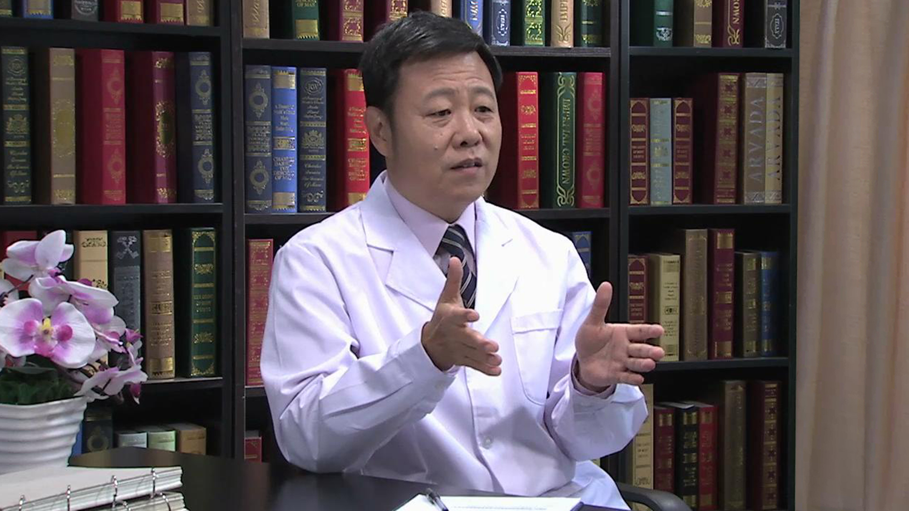

# 17.16 精神疾病的康复治疗

---

## 姚贵忠 主任医师

北京大学第六医院副院长 主任医师 医学博士。

中国精协精神残疾社区促进工作委员会副主任委员；中国残疾人康复协会精神残疾康复专业委员会副主任委员；中国社区卫生协会常务理事；国家卫计委“国家基本公共卫生服务规范”重性精神疾病专家组组长；北京市首批健康科普专家。

**主要论文及编著：** 撰写论文30余篇，参编10余部精神病学专著。

**专业特长：** 擅长各类精神疾病的诊疗，长期从事社会心理康复、家庭干预以及社区防治的实践与研究。

---
