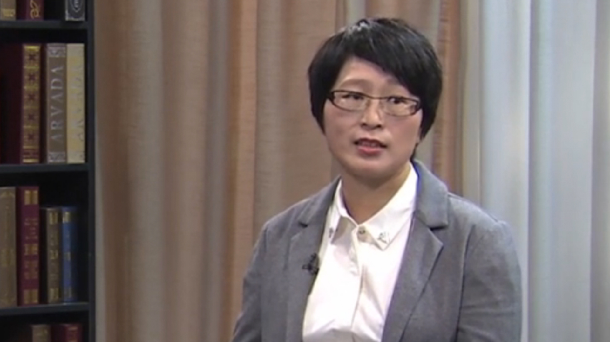

# 17.23 认知行为治疗

---

## 李献云 主任医师

北京大学回龙观临床医学院北京回龙观医院临床三科主任 主任医师。

中国心理卫生协会危机干预专业委员会副主任委员；中华预防医学会伤害预防与控制分会常务委员；中华预防医学会伤害预防与控制分会自杀干预学组组长；北京市首批健康科普专家；美国专业学会认证的认知行为治疗师和问题解决治疗师；多家学组委员和杂志编委。

 **主要成就：** 发表研究论文八十余篇，著书一部，并参与多部中英文书籍章节的撰写；翻译校对网上认知行为治疗MoodGYM和《自杀预防——全球要务》一书；作为第一完成人曾获北京市科学技术三等奖。

 **专业特长：** 擅长精神障碍的诊断与治疗、认知行为治疗和危机干预，特别是抑郁障碍、焦虑障碍、创伤及应激相关障碍、强迫症、失眠、自杀倾向等的诊断与治疗。

---
