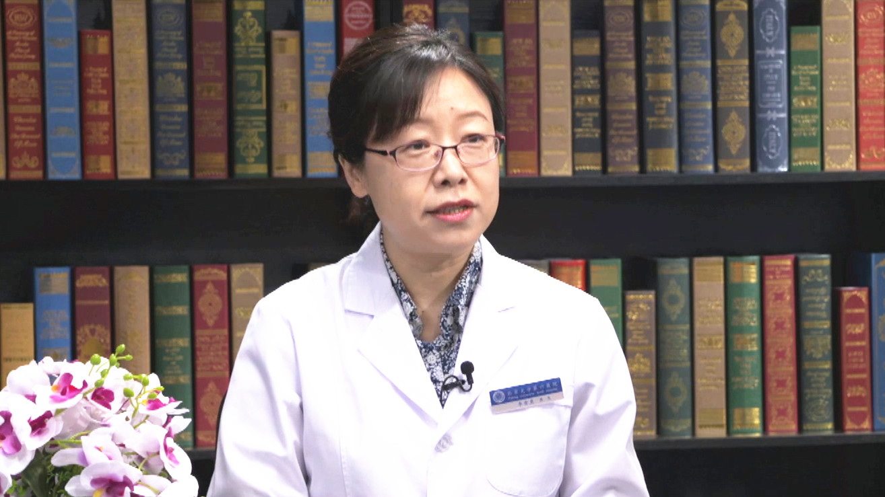

# 17.25 神经性厌食（厌食症）

---

## 李雪霓 主任医师

北京大学第六医院综合三科主任 主任医师。

北京大学第六医院进食障碍诊疗中心副主任；中华医学会心身医学分会进食障碍协作学组副组长；中国医师协会危机干预委员会委员；中国心理卫生协会心身医学专业委员会委员；北京医学会心身医学分会常委。

**主要成就：** 于2006年加入北大六院进食障碍诊疗与研究团队，是进食障碍规范化诊疗服务体系建设的主要成员之一，建成国内目前唯一一个集中收治进食障碍患者的病房及与之配套的专业门诊和康复组织，于2017年推进了北大六院进食障碍诊疗中心的成立；协助指导完成硕士研究生课题5人次，近5年在国内核心期刊和国外SCI期刊发表进食障碍相关论文9篇，其中第一或责任作者6篇；参编专业书籍《进食障碍咨询与治疗》《中国进食障碍防治指南》，主译科普书籍《与进食障碍分手》。

**专业特长：** 擅长进食障碍的综合治疗。

---
