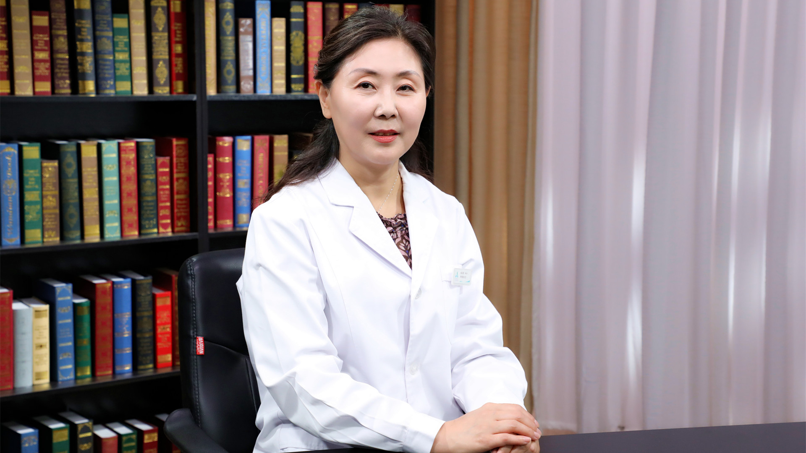

# 17.28 心境障碍的护理

---

## 安凤荣 主任护师

首都医科大学附属北京安定医院护理部主任 主任护师 硕士生导师。

北京护理学会精神卫生专业委员会主任委员；中华护理学会精神卫生专业委员会副主任委员 护理科普专家；中国心理卫生协会护理心理专业委员会副主任委员；北京医学会医学伦理学专业委员会护理学组委员。

**主要成就：** 担任《中华护理杂志》《中国护理管理杂志》《中华现代护理杂志》编委；作为项目负责人承办了10余项国家级、市级继续教育项目，受众几千人，取得了较好的社会效应；以第一作者及通讯作者在核心期刊发表论文30余篇，其中SCI论文近20篇，参与多部著作的撰写；2017年获得中华护理杂志社颁发的“全国优秀护理部主任”荣誉称号；2018年获得首都医科大学颁发的“首医科技之星”荣誉称号，并在同一年被评为中华护理杂志社“优秀编委”；2019年获得“首都杰出护理工作者”荣誉称号。

**专业特长：** 从事精神科护理工作34年，擅长先进的精神科临床护理技术，特别是对“情感性精神障碍、精神分裂症”的护理有较深刻的探索和研究。

---
