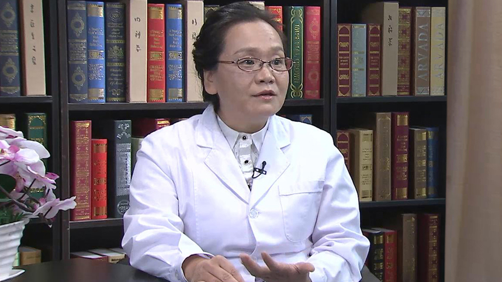

# 17.34 抑郁症

---

## 牛雅娟 主任医师

北京回龙观医院临床心理科主任 主任医师 教授。

中华医学会精神科分会物质依赖学组委员；中国医师协会精神科医师分会成瘾专业委员会委员；中国性学会性医学专业委员会委员；中国药物滥用防治协会成瘾医学分会第一届理事会理事；中国控制吸烟协会精神心理控烟专业委员会第一届委员会委员；中国抗衰老学会性健康分会委员；北京市健康科普专家；国家二级心理咨询师评审专家；香港戒瘾协会认证的国际成瘾咨询师。

**主要成就：** 主持北京市科委首都临床特色应用研究等专项课题；在中英文核心期刊发表论文40余篇，作为编委参编专业论著8部。

**专业特长：** 擅长抑郁症、焦虑症、强迫症、物质依赖、睡眠障碍的药物治疗和心理治疗，精神分裂症、双相情感障碍的药物治疗，婚姻家庭问题和亲子关系问题咨询。

---
