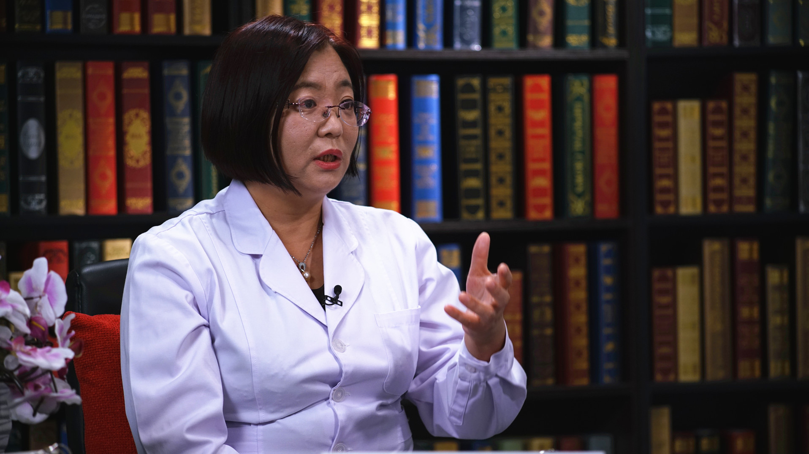

# 17.35 抑郁症的中医治疗

---

## 郭蓉娟 主任医师

北京中医药大学东方医院副院长 主任医师 博士生导师。

王永炎名医传承工作室负责人；世界中医药学会联合会中医心理学专业委员会副会长；世界中医药学会联合会心身医学分会副会长；世界中医药学会联合会医养结合专业委员会副会长。

**主要成就：** 发表论文百余篇，主编论著3部；近5年连续主持国家自然基金课题3项，主持省部级课题4项，校级课题1项；参与课题10余项；取得治疗失眠的国家专利1项；系列研究获得北京市科学技术奖，北京市科技进步奖。

**专业特长：** 擅长中西医结合，药物与心理结合，综合防治中风病、焦虑、抑郁、失眠、头痛、眩晕、记忆力减退及痴呆、癫痫、帕金森病、重症肌无力、多发硬化等多种复杂疑难疾病。

---
