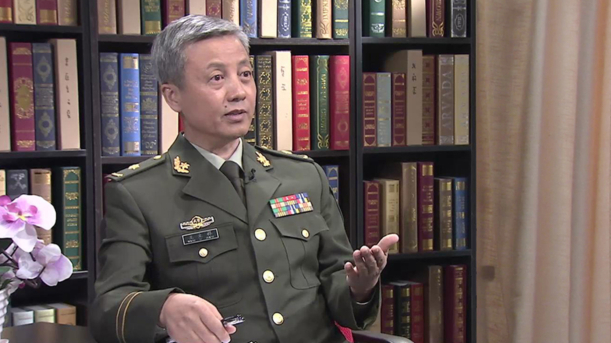

# 18.1 腹部心肺复苏

---

## 王立祥 主任医师

中国武警总医院急救医学中心主任 主任医师 博士生导师 教授。

中国腹部心肺复苏学创始人；中华医学会科学普及分会主委；中国研究型医院学会心肺复苏学专业委员会主委。

**主要成就：** 荣获全国优秀科技工作者终身荣誉称号；发明复苏救援装置及方法20余种；获专利27项，科技奖16项；撰写《中国精准心肺复苏专家共识纲要》草案。

**专业特长：** 擅长疑难急危重病的诊治，尤以心肺脑复苏领域为专长。

---
