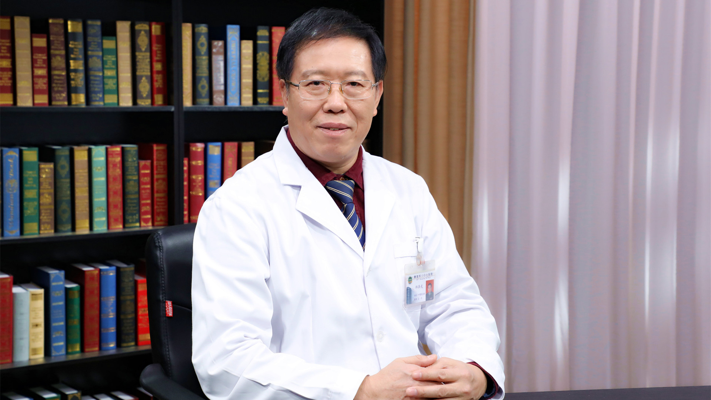

# 18.5 急性中毒的处理

---

## 邱泽武 主任医师

解放军总医院第五医学中心中毒救治科主任 主任医师 博士生导师。

中国毒理学会中毒与救治专业委员会主任委员；中国研究型医院学会心肺复苏学专委会副主任；中央保健委员会会诊专家；国家突发事件卫生应急中毒处置组专家；国家食品安全风险评估监测分委会专家。

**主要成就：** 承担军队“十二五”、“十三五”、国家科技支撑计划及北京市自然基金等课题10项；发表学术论文156篇，主编专著1部，参编著书21部；获国家科技进步一等奖1项，军队科技进步一等奖1项，中华医学科技奖三等奖1项。

**专业特长：** 擅长百草枯、有机磷农药、杀鼠剂、重金属、肉毒毒素、常见药物、动植物及有毒气体中毒的诊断和治疗；从事中毒性疾病的基础研究与临床诊治30多年，是我国著名的中毒急救专家。

---
