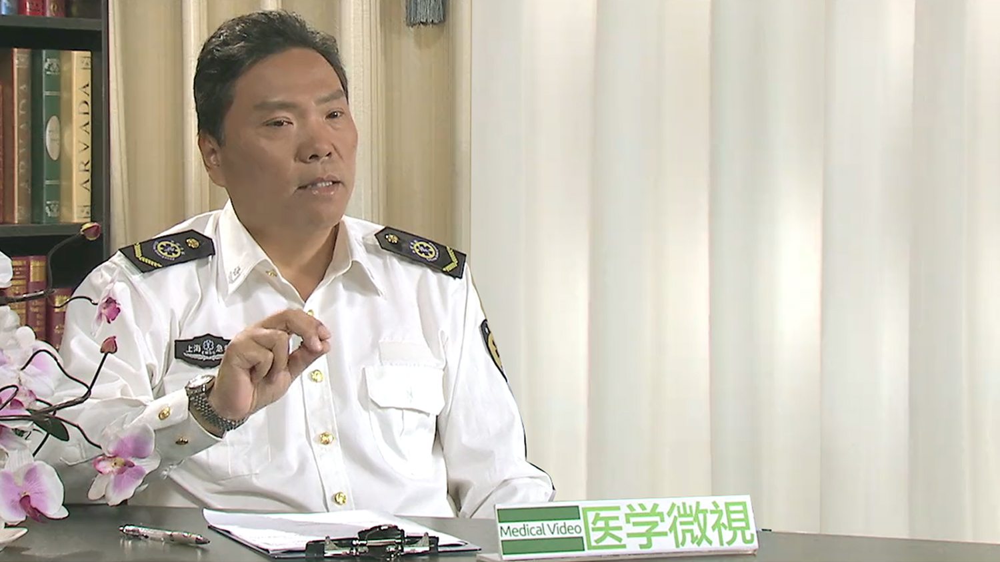

# 18.9 气道异物梗阻的急救

---

## 陆峰 主任医师

上海市医疗急救中心 副主任 主任医师。

中华医学会急诊医学专科委员会院前急救学组 副组长；中国医院管理协会急救中心（站）管理分会第三届委员会中青年学组委员； 中国医院管理协会急救中心（站）管理分会航空医疗救援专业学组委员；中国医院管理协会急救中心（站）管理分会水上医疗救援专业学组委员；中国医师协会创伤外科医师分会灾难与创伤急救医师专业委员会委员；上海医学会急诊专科分会委员会委员；上海市院前急救质量控制中心专家委员会委员；上海市医学会急诊专科分会委员会院前急救学组组长；上海市医师协会急诊专业分会委员。

**主要成就：** 长期从事院前急救医疗及管理工作，目前分管上海市医疗急救中心科研、 教育、培训和院前急救质量控制工作。负责完成多项院前急救领域上海市局级课题。专业核心期刊发表论文近二十篇，参编高等院校教材三部。

**专业特长：** 擅长急救管理工作。

---
