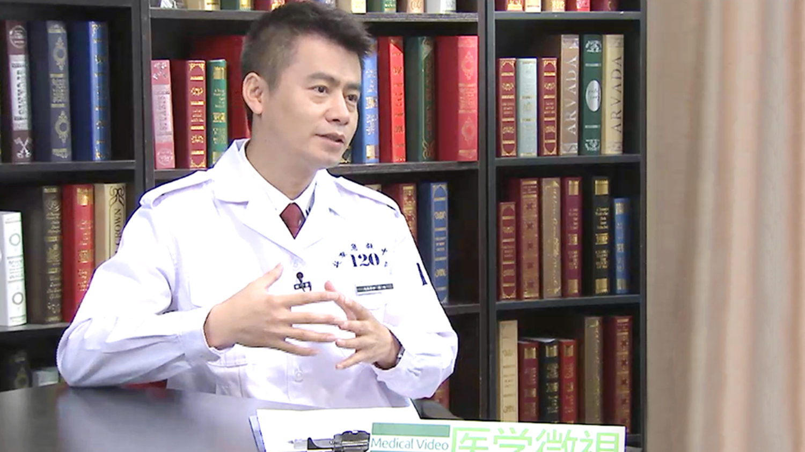

# 18.12 外伤急救

---

## 陈志 副主任医师

北京急救中心副主任医师 北京急救医疗培训中心副主任。

中国医院协会急救中心（站）管理分会全国培训办公室专业技术组组长；中国心胸血管麻醉协会急救与复苏分会秘书长；心肺复苏全国委员会常务副主任；中国医疗救援协会急诊分会委员；灾害分会理事；国际创伤生命支持理事会核心理事/中国分部（120）医疗主任；美国心脏协会（AHA）-BLS/ACLS大中华区主任导师。

**主要成就：** 2006年获第一届全国急救技能大赛个人和团体冠军，被授予“全国医疗急救技术状元”称号； 在国内外核心期刊上发表论文21篇，主编专业急救书籍5部，参与编著7部；2007-2008年在北京奥组委医疗卫生处负责北京奥运会医疗急救项目组织与管理，独立编写了《北京奥运会残奥会医疗急救技术规范手册》。

---
