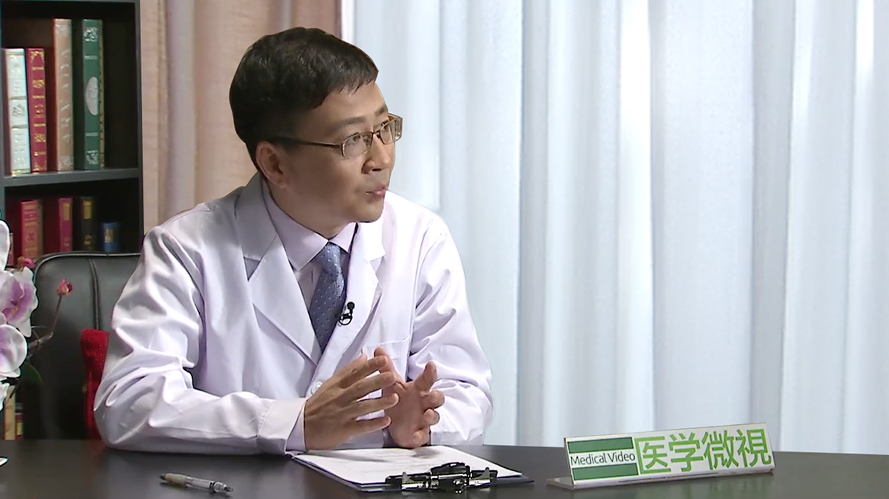

# 18.15 心肺复苏

---

## 应旭旻 主任医师

医学博士 主任医师 硕士生导师 具备中西医双学历。

浙江省杭州市急救中心党总支书记 主任 ；中国医院协会急救中心（站）管理分会常务委员 中青年学组组长 ；华东地区急救中心（站）管理学会 副主任委员 ；《中华急诊医学杂志》编委； 浙江省中医药学会博士学术研究分会 常务委员； 浙江省中医药学会中医基础理论研究分会 委员； 杭州市医学会院前急救分会 主任委员； 杭州市院前急救质量控制中心 主任 ；曾任杭州市中医院副院长； 曾任杭州市卫生局办公室副主任；曾任杭州市红十字会医院副院长；先后主持承担国家自然基金、省自然基金、省卫生厅、省中管局等科研项目十余项，在国家级、省级刊物发表论文二十余篇。

**专业特长：** 擅长急救管理工作。

---
