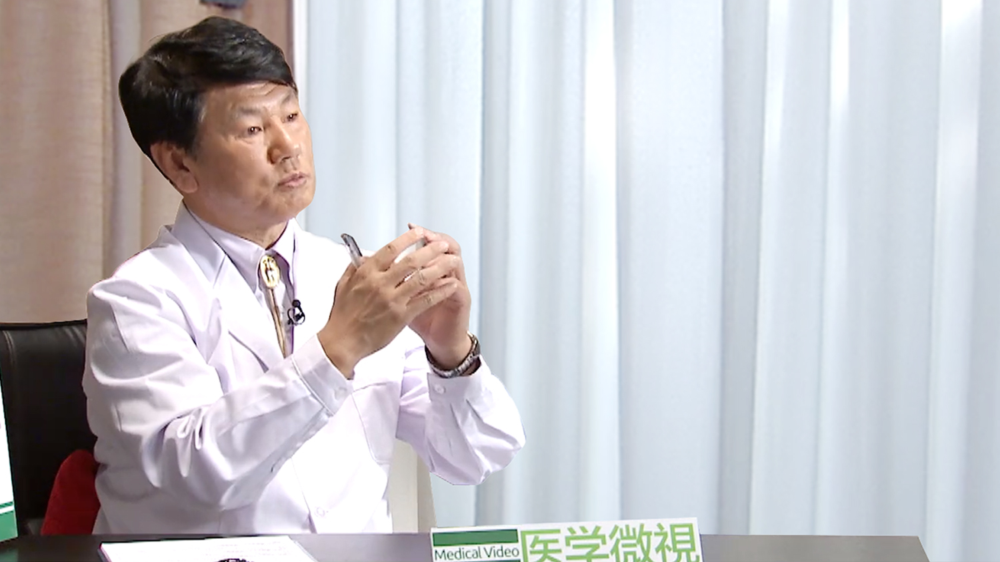

# 18.16 眼外伤

---

## 马志中 主任医师

北京大学眼科中心常务主任。

中华眼科学会眼外伤学组名誉组长；中国微循环学会眼微循环专业委员会理事；国际眼外伤学会中国代表；亚太玻璃体视网膜学会理事；曾任解放军眼科学会主任委员；全国著名眼外伤、眼底病专家；国内眼科界出名的“四把刀”之一，被誉为“玻璃体视网膜手术一把刀”。

**专业特长：** 擅长眼外伤、眼底病的诊治。

---
