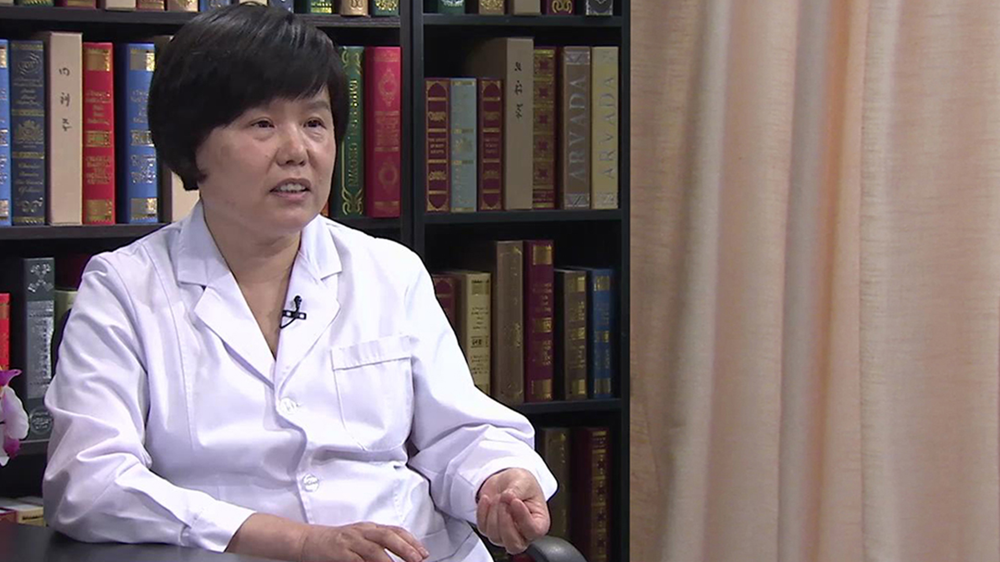

# 19.4 艾滋病、梅毒、乙肝的母婴阻断

---

## 刘敏 主任医师

北京地坛医院妇产科主任 主任医师；中华医学会感染病分会产科感染与肝病学组委员。

北京医学会计划生育分会常委；北京医学会围产医学分会委员；北京市妇幼卫生保健专家组成员；北京市计划生育技术服务专家委员会专家；北京市预防艾滋病母婴传播技术专家指导组专家。

**主要成就：** 参加多项国际、国内的乙肝母婴阻断的研究，撰写论文数篇。

**专业特长：** 擅长妇产科常见病、疑难病的诊治，对病理产科、产科危重症的抢救有较丰富的经验，熟练完成各种妇产科手术，如开腹子宫切除、阴式子宫切除、复杂子宫内膜异位症手术、卵巢癌手术、宫颈癌根治术，各种剖宫产手术、产钳术等，熟练掌握宫腔镜及腹腔镜微创技术，对传染病合并妇产科疾病的诊断和治疗有丰富的经验，特别是对肝病合并妊娠、乙肝的母婴传播，有较深入的研究。

---
