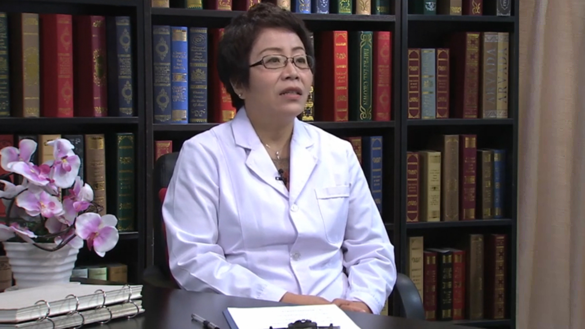

# 19.8 丙肝系列1

---

## 窦晓光 主任医师

中国医科大学附属盛京医院感染科主任 博士生导师 教授。

中华医学会肝脏病学分会副主任委员；辽宁省肝病学会主任委员；辽宁省感染病与寄生虫学会副主任委员；辽宁省医学会第六届理事会理事；辽宁省肝病治疗与研究中心主任；辽宁省传染病医学中心主任；辽宁省重大传染病（肝病）转化中心主任；中华肝脏病杂志副主编；中国实用内科杂志副主编。

**主要成就：** 主持及参加国家级和省市级科研课题10余项，获得省级科技进步二等奖3项，三等奖4项；发表学术论文150余篇。

**专业特长：** 作为传染病和肝病的临床专家。熟练掌握本专业常见病、多发病诊治的新进展及新技术，负责辽沈地区危重症传染病、重症感染性疾病及重症肝病抢救及疑难病症的会诊及抢救工作，是辽宁省传染病诊断和治疗首席专家，首届辽宁名医。

---
