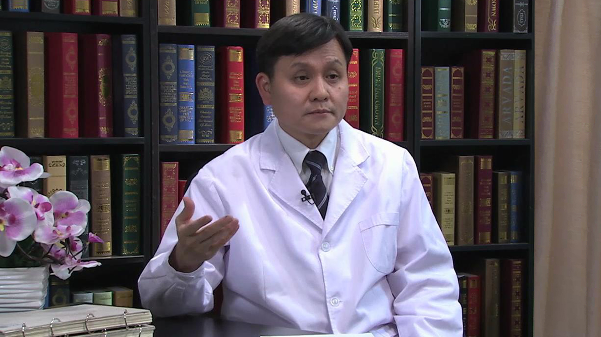

# 19.9 丙肝系列2

---

## 张文宏 主任医师

复旦大学附属华山医院感染科主任 主任医师 博士生导师 教授。

中华医学会感染病学分会常委兼秘书长；上海感染病医师协会会长；上海市肝病研究所副所长；上海市抗生素研究所副所长；《微生物与感染》执行主编；《Emerging Microbes and Infection》 杂志副主编；《中华传染病杂志》副总编辑。

**专业特长：** 长期从事感染性疾病的临床工作。擅长疑难感染性疾病的诊治以及慢性肝病个体化治疗新方案的研究；擅长慢性乙型肝炎，慢性丙型肝炎，不明原因肝功能损害，各类疑难感染性疾病的治疗。

**主要成就：** 获中华医学奖，上海市科技成果奖等多项奖项；被评为上海市领军人才，上海市优秀学科带头人；牵头国家十五攻关、十一五攻关、十二五攻关重大传染病专项课题；曾发表论文200余篇，在CID、AAC、AIDS、JCM、JV、Immunity、Journal of Hepatology等杂志上发表国际SCI 论文60余篇。

---
