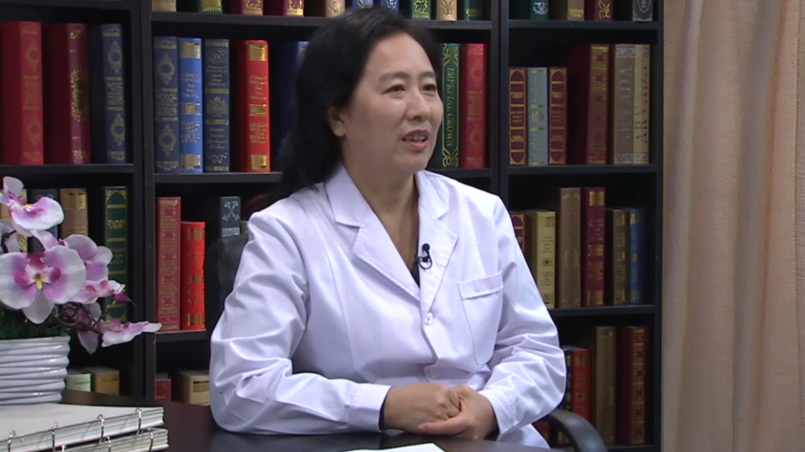

# 19.10 丙肝系列3

---

## 南月敏 主任医师

河北医科大学第三医院中西医结合肝病科主任 主任医师 博士生导师 教授。

享受国务院特殊津贴专家；中华医学会肝病学分会副主任委员；中国中西医结合医师协会肝病专家委员会副主任委员；中国民族医药学会肝病学/传染病分会常务理事；河北省医学会第七届理事会理事；河北省医学会肝病学分会主任委员；河北省医师协会肝病学分会主任委员；河北省中西医结合学会肝病专家委员会主任委员。

**主要成就：** 承担国家级及省部级课题及获河北省科技奖多项 ；发表SCI、中华系列及核心期刊论文150余篇；主编及参编著作10部 ；参编指南/共识16部。

**专业特长：** 擅长各种急慢性肝病，疑难及重症肝病，包括病毒性肝炎；酒精性肝病；脂肪性肝病；药物性肝病；自身免疫性肝病；遗传代谢性肝病；妊娠期肝病；肝硬化；顽固性腹水；上消化道出血；肝性脑病及肝脏肿瘤的诊断与治疗。

---
