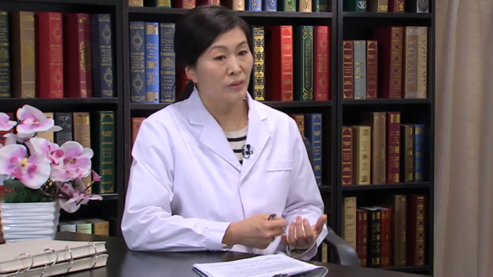

# 19.11 丙肝系列5

---

## 李杰 研究员

北京大学医学部基础医学院 副教授 硕士生导师。

中华医学会肝病学分会常委兼秘书长；北京医学会肝病学分会常委；《中华肝脏病杂志》编委；《中国病毒病杂志》编委；《肝脏》编委；《实用肝脏病杂志》编委；《临床肝胆病杂志》编委。

**主要成就：** 获中华医学科技一等奖1项；中华医学科技二等奖1项；卫生部医药科技进步二等奖1项；海南省科技进步三等奖1项；负责并参加多项国家级、省部级科研课题的研究工作；发表中英文论著100余篇，其中以第一作者及通讯作者发表51篇。

**专业特长：** 擅长病毒性肝炎的病原学；分子病毒学；预防及流行病学。

---
