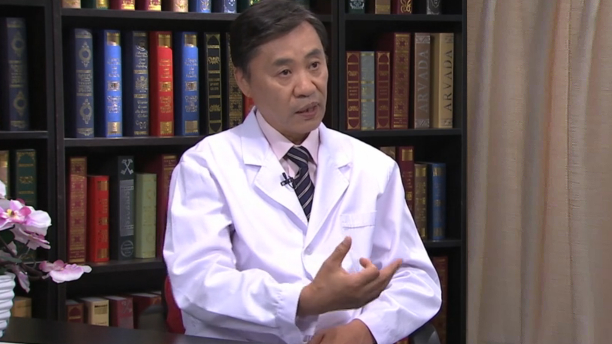

# 19.15 布氏杆菌病

---

## 李兴旺 主任医师

首都医科大学附属北京地坛医院感染性疾病诊疗中心首席专家 博士生导师。

卫计委感染性疾病医疗质量控制中心主任；中华医学会公共卫生学分会副主任委员；国家传染病标准专委会副主委；中国性病艾滋病协会常务理事；北京医学会理事、感染学会前任主任委员；北京医师协会理事、感染科分会副会长；卫计委突发事件、卫生应急、合理用药等专家委员会委员；北京红丝带之家秘书长。

**主要成就：** 主持及参加国家级和省市级科研课题10余项；获得国家级科技进步一、二等奖各一项，省级一等奖2项、二等奖2项、三等奖2项；发表学术论文100余篇。

**专业特长：** 从事传染病临床工作30余年，擅长常见传染病的诊断、治疗及与传染病相关疑难病症的鉴别诊断。多年来承担着我国重大和新发突发传染病疫情现场处理、临床救治等工作。作为主要作者参与了卫生部和中华医学会的多个传染病诊断标准和防治方案的制定。

---
