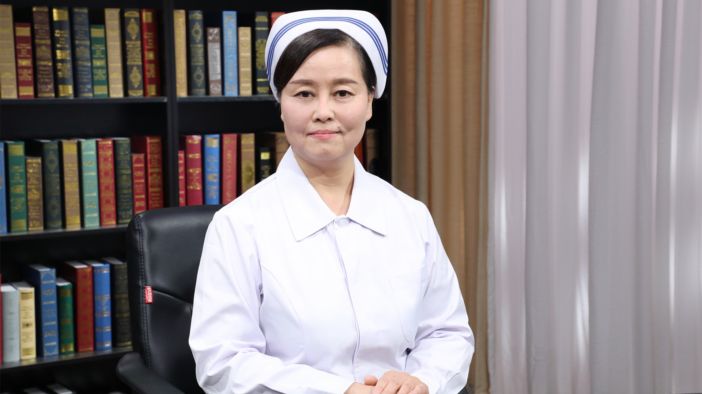

# 19.19 肺结核的护理

---

## 王秀华 主任护师

首都医科大学附属北京胸科医院护理部主任。

中国防痨协会结核病临床专业委员会护理学组组长；中华护理学会外科专业委员会委员；北京护理学会外科专业委员会副主任委员；北京市护理高级职称评审委员会评审专家；《中华护理杂志》编委。

**主要成就：** 在核心期刊公开发表论文30余篇，主编、副主编、参编著作7部；2014年被北京护理工作者协会评为第三届“北京市优秀护士”；2015年荣获国际护士会(ICN)授予的“领导力之光”。

**专业特长：** 擅长结核病护理、护理管理。在胸部疾病护理领域，尤其是在结核病护理领域已成为国内的学科带头人。

---
