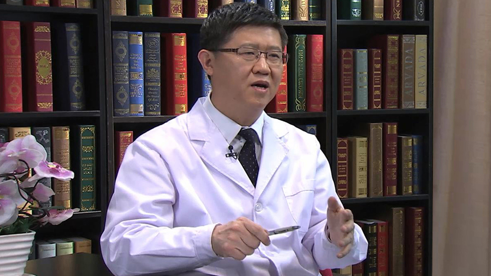

# 19.33 诺如病毒

---

## 陈志海 主任医师

首都医科大学附属北京地坛医院感染中心副主任 医学硕士 主任医师 博士生导师。

中华医学会北京分会感染专业委员会副主任委员 感染病学分会委员；中华医学会热带病与寄生虫学分会委员；中华预防医学会感染性疾病防控分会常务委员；北京预防医学会感染病学专委会副主任委员；国家卫生健康标准委员会传染病标准专业委员会委员；《中华传染病杂志》编委。

**主要成就：** 以第一作者或通讯作者发表SCI论文9篇；牵头制订卫生行业标准1项，并参与制订其他标准多项；参与10余个国家级指南或诊疗方案的制订；曾获得中华预防医学会科学技术奖一等奖，中华医学科技奖三等奖。

**专业特长：** 擅长于各种急性传染病的诊断与治疗。

---
