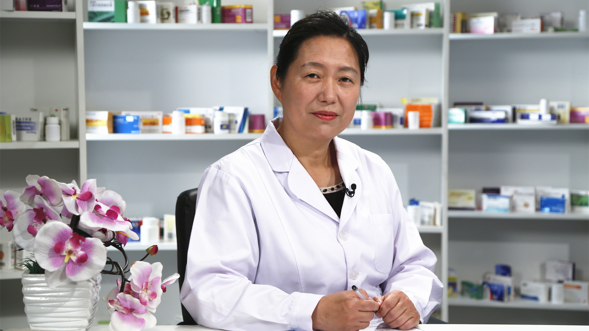

# 19.44 乙肝小分子抗病毒药物

---

## 高燕菁 主任药师

首都医科大学附属北京地坛医院药学部主任药师。

世中联临床用药安全研究专业委员会成员；中国中医药信息研究会中药调配与监测分会常务理事。

**主要成就：** 发表核心期刊论文20余篇；发表科普文章80余篇。

**专业特长：** 擅长肝病、艾滋病、流感、手足口病等感染性疾病的临床药学研究，负责门诊药物咨询工作。

---
