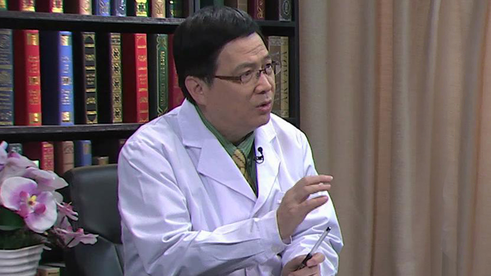

# 19.45 乙肝系列1

---

## 徐小元 主任医师

北京大学医学部传染病学系主任；中华医学会肝病学分会侯任主任委员；中华医学会肝病学分会肝纤维化学组组长；中华医学会传染病分会艾滋病学组副组长；北京市肝病学分会副主委。

**主要论文：** 主持或起草《国家甲型H1N1流感诊疗方案》《国家禽流感防治方案》《肝硬化门脉高压食管胃静脉曲张出血的防治指南》等；发表论文、综述等200余篇；主编或副主编专著、教材等15套。

**专业特长：** 擅长肝硬化上消化道出血、病毒性乙、丙型肝炎的诊断和治疗。不明原因发热等疑难病症的临床诊断与治疗。

---
