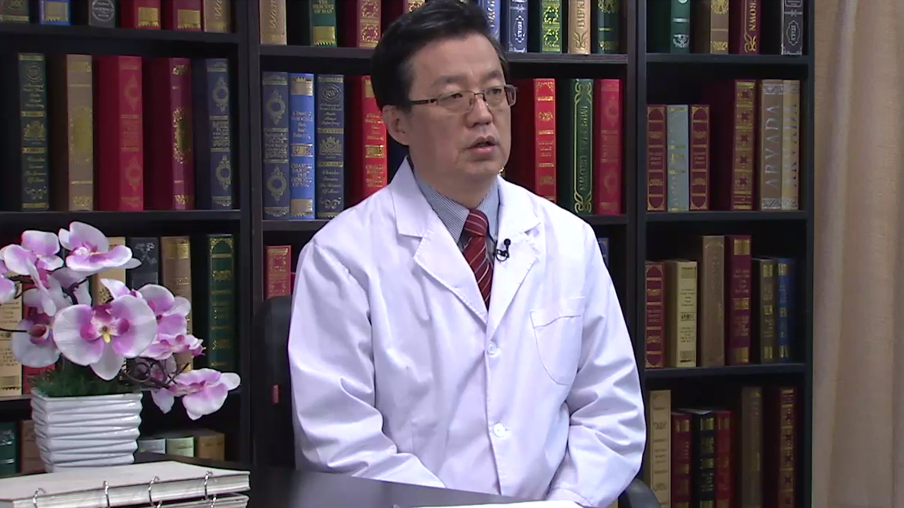

# 19.47 乙肝系列3

---

## 侯金林 主任医师

南方医科大学南方医院感染内科主任 主任医师 博士生导师。

亚太地区肝病学会主席；国务院特殊津贴专家；中华医学会感染病学分会前任主任委员；南方医科大学肝脏疾病研究所所长；广东省病毒性肝炎重点实验室的主任

**主要成就：** 获国家科技进步二等奖二项，中华医学科技二等奖，广东省科技进步一等奖，荣立军队一等功一次，三等功三次；2003年获得国家杰出青年基金；主持和完成多项国内多中心的临床研究、国家自然科学基金重点项目等，其中“慢性乙型肝炎临床治疗方案的优化及影响疗效的因素”研究，获得了国家“十二五”重大科技专项资助；国内外杂志发表论文300余篇, 其中SCI论文120余篇。

**专业特长：** 擅长传染病的诊治；长期致力于传染病学，尤其是肝病的基础和临床和研究工作，对疑难和复杂感染性疾病及肝病具有丰富的临床经验，开拓了慢性乙型肝炎抗病毒的个体化治疗和乙肝临床转化医学研究的新方向，取得了多项理论创新和一系列重要发现成果。其中“慢性乙型肝炎临床治疗方案的优化及影响疗效的因素”研究填补了国内本研究领域的空白。

---
