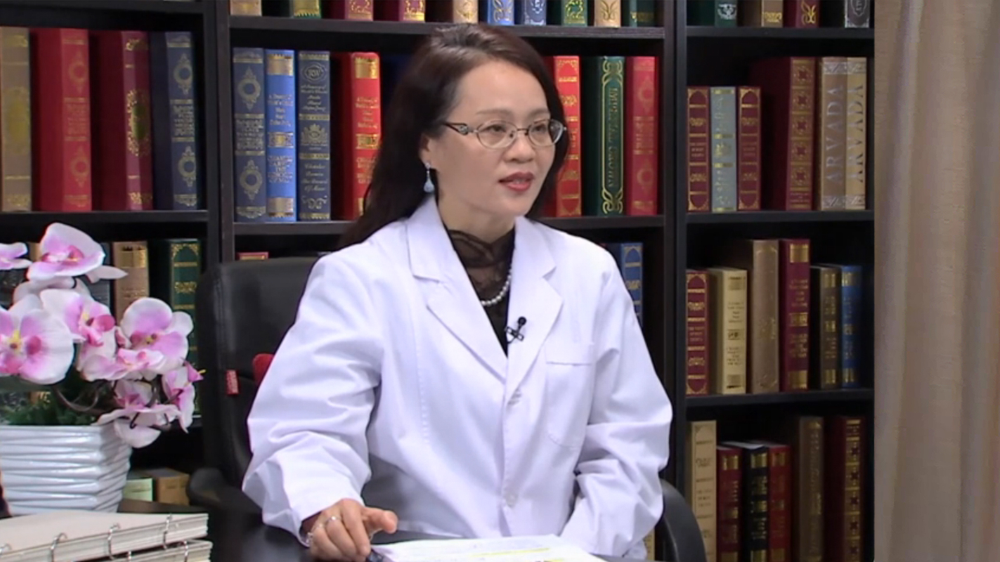

# 19.48 乙肝系列4

---

## 宁琴 主任医师

华中科技大学同济医学院附属同济医院 传染病学教研室/感染科主任 主任医师 博士生导师 教授。

感染性疾病研究所所长；中华医学会感染病学分会副主任委员；中华预防医学会感染病控制分会副主任委员；湖北省医学会感染病分会主任委员；湖北省医学会肝脏病学分会副主任委员；亚洲肝病学会(APASL)肝衰竭工作组专家成员。

**主要成就：** 先后主持国家自然科学基金杰出青年科学基金项目及重点项目、国家973计划重大项目、国家十一五/十二五传染病重大专项、国家临床重点专科项目等。获教育部“自然科学奖”二等奖；获湖北省自然科学奖一等奖。

截止到2016年12月，共发表论文200余篇，其中SCI论文223篇，并被SCI论文引用1847（他引1368）。发明专利6项。

**专业特长：** 主要从事肝脏疾病病包括慢性病毒性肝炎；脂肪肝；肝纤维化；重型肝炎和肝癌的基础与临床研究。

---
