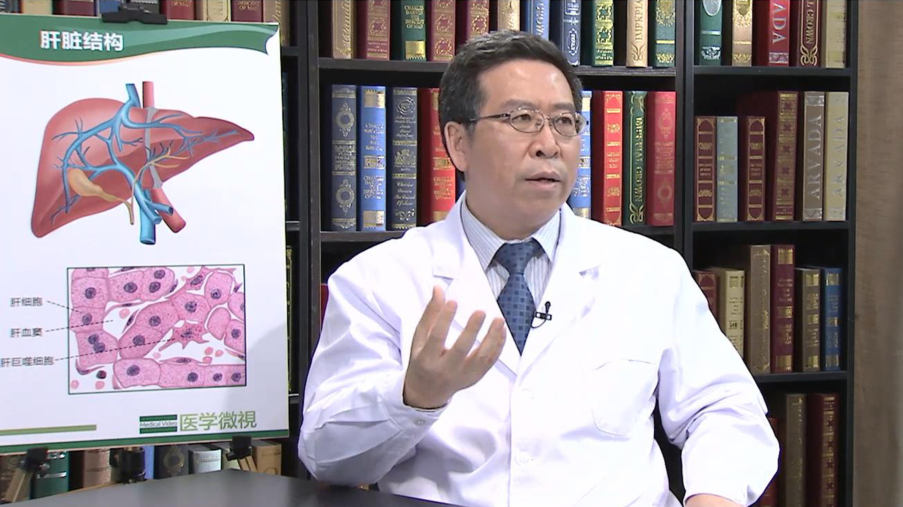

# 19.50 乙肝系列6

---

## 王贵强 主任医师

北京大学第一医院感染疾病科主任兼肝病中心主任 主任医师 博士生导师 教授。

北京大学国际医院感染和肝病中心共同主任；中华医学会感染病学分会主任委员；中国医师协会感染病医师分会副会长；中国医师协会理事；中国免疫学会感染和免疫分会常委；北京医师协会常务理事。

**主要成就：** 获“国家科技进步奖”三等奖一项；获 “第八届中国医师奖”；主持修订了国家标准《乙型病毒性肝炎诊断标准》；参加《中国慢性乙型肝炎防治指南》编写；发表论文200余篇，其中SCI论文50余篇。

**专业特长：** 致力于病毒性肝炎和肝病的诊断和治疗研究，擅长发热待查的鉴别诊断，各种感染性疑难重症疾病的诊断治疗等。

---
