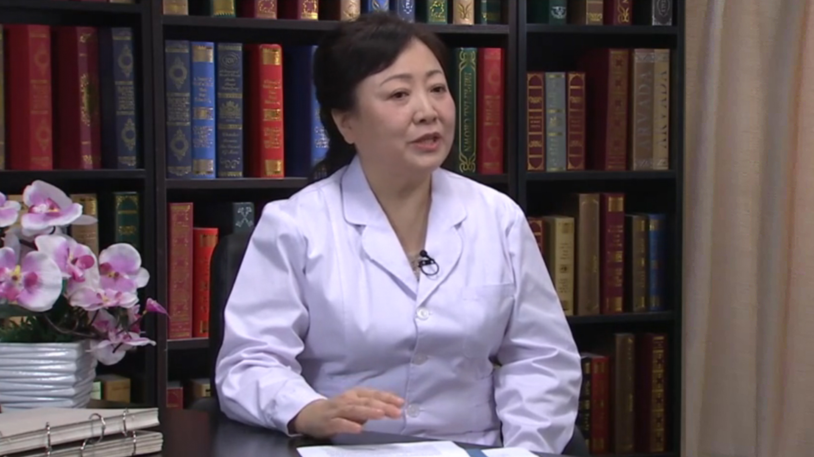

# 19.51 乙肝系列7

---

## 孟庆华 主任医师

首都医科大学附属北京佑安医院肝病重症医学科主任 博士生导师 教授。

中华医学会北京分会感染病学分会主任委员；中华医学会感染病学分会常务委员兼秘书长；中华医学会北京分会肠外肠内营养专业委员会常务委员；中国医师协会感染病学分会常务委员；北京医师协会感染病学分会副会长；享受国务院特贴。

**主要成就：** 主持及参加国家级和北京市科研课题10余项，获北京市科技进步一等奖、三等奖及中华医学科技奖二等奖；发表学术论文100余篇。

**专业特长：** 擅长传染及感染性疾病、急慢性肝炎、肝硬化、妊娠期肝病、肝癌、肝衰竭等疾病的治疗。

---
