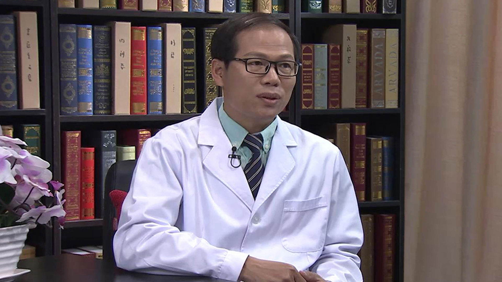

# 19.54 寨卡病毒

---

## 蒋荣猛 主任医师

首都医科大学附属北京地坛医院感染二科主任医师 硕士生导师。

中华医学会公共卫生分会青委会副主任委员；北京医学会病毒学分会委员；北京市感染性疾病医疗质量控制中心专家委员会委员。

**主要成就：** 2011年获得北京市科技进步奖一等奖一项 ；2015年获得国家埃博拉防治先进个人 ；发表中英文论文40余篇，参与专业著作撰写4部 ；撰写大量传染病相关科普文章 。

**专业特长：** 熟练掌握各种感染性疾病的诊治；擅长对发热待查，突发、新发传染病的临床处置；擅长将医学专业知识科普化。

---
