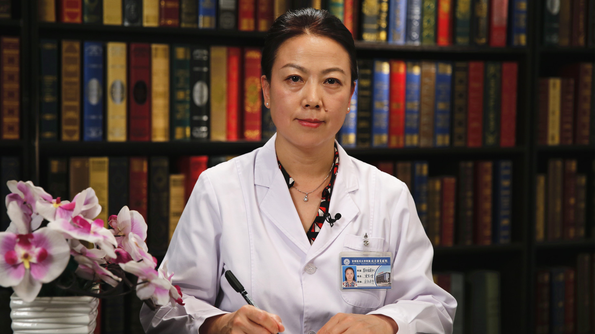

# 20.2 肠梗阻

---

## 贾军峰 主任医师

首都医科大学附属北京康复医院胃肠康复中心主任 主任医师。

中华中医药学会肛肠分会常务理事；中国中医药学会全科医师分会常务理事；中国中医药研究促进会肛肠分会常务理事；中医药高等教育委员会临床教育研究会肛肠分会常务理事；北京肛肠学会胃肠康复专业委员会主任委员。

**主要成就：** 建立了外科疾病围手术期临床融合康复治疗的学科特色；建立了胃肠、肛肠疾病的康复评估与康复治疗体系；对神经源性便秘的康复治疗有深入研究。

**专业特长：** 擅长胃肠疾病、肛肠疾病、乳腺及甲状腺疾病、肝胆胰脾疾病及腹部多发创伤等疾病的外科治疗及康复治疗。尤其对胃肠、肛门疾病的临床治疗与康复治疗有深入的研究。

---
