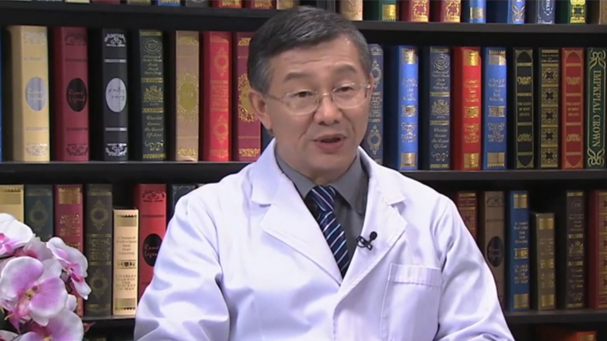

# 20.3 大肠癌

---

## 姜泊 主任医师

清华大学附属北京清华长庚医院内科部部长 消化中心主任 主任医师。

清华大学临床医学院教授；国务院特殊津贴专家；中华医学会消化内镜分会副主任委员；中华医学会消化病学分会常委；广东省医学会消化病学分会主任委员；《中华消化内镜杂志》等3个杂志副总编。

**主要成就：** 2015年度获何梁何利基金科学与技术进步奖；以第一完成人获国家科技进步二等奖1项，广东省科技进步一等奖2项；获国家发明专利7项，实用专利11项；主编《内科学》《胃肠病学》等教材和专著10余部；发表论文300余篇，SCI论文达100余篇，其中以通讯作者发表SCI论文50余篇。

**专业特长：** 致力于胃肠道微生态系统与肠粘膜屏障、炎性肠病和功能性胃肠疾病等疾病的研究，擅长内镜下诊治早癌及癌前病变，比如大肠癌的早期诊治。

---
