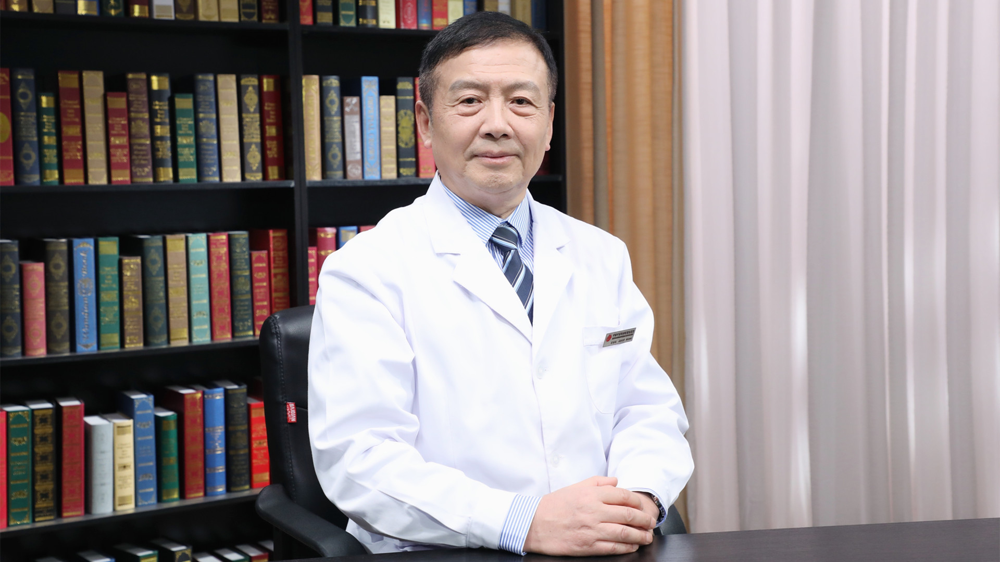

# 20.5 肛肠疾病的诊治

---

## 李东冰 主任医师

中国中医科学院西苑医院肛肠科原主任 主任医师 教授 硕士生导师。

北京肛肠学会会长；中国医师协会中西医结合医师分会肛肠病学专家委员会名誉主任委员。

**主要成就：** 获北京市科技进步二等奖1项、三等奖3项，北京市卫生局科技进步一等奖1项，北京市中医管理局科技进步一等奖1项、二等奖2项，北京市西城区科技进步一等奖4项，中国中西医结合学会科技进步奖1项，中国中医科学院科技进步奖1项；在《中华医学杂志》等杂志发表论文50余篇，主编专著2部，参编专著4部；在肛肠疾病的诊断、治疗及预后各方面总结、归纳、创造出了一系列的手术方式与治疗规范：1、铜离子电化学疗法治疗痔出血及痔脱出。衍化出CORE疗法，适用于全部的混合痔非环形脱出问题。提出了NONRING-PPH手术，以无痛或者微痛方法治疗了全部各类痔病患者，攻克了痔术后的并发症问题，基本解决了困扰患者的痔术后疼痛问题，站在国际领先水平。2、在便秘和溃疡性结肠炎的治疗上提出穴位强化埋线疗法。3、在直肠脱垂治疗上提出一种STAPRE手术的新术式，并取得很好的疗效。4、提出了肛周脓肿和肛瘘治疗的新观念，即跳跃式接力切开短程挂线，将肛瘘术后复发的比例由20％降至1％以下。5、在直肠肿瘤的早期诊断和保肛手术治疗方面以及经肛门手术方面积累了丰富经验。将创造的STAPRE手术应用于经肛门治疗早期直肠癌和巨大肛门腺瘤，拓宽了保肛的范围和扩大了可行手术的范围。6、大量完成了全国各个大医院血液病患者合并肛门疾病的会诊和治疗任务（目前已处理5000余例），成为世界上处理血液病合并肛门疾病数量最大，经验最丰富的专家。

**专业特长：** 擅长各类痔疮的微痛、微创治疗；各类高位复杂肛瘘的根治性治疗；各类肛周脓肿的微痛治疗；直肠脱垂的微痛、微创治疗；直肠肿瘤的经肛门手术；直肠癌的预防与早期发现；肛周严重感染的抢救性治疗（坏死性筋膜炎)；肛周多发性汗腺炎、藏毛窦感染的根治；血液病肛周感染的处理与预防等。

---
