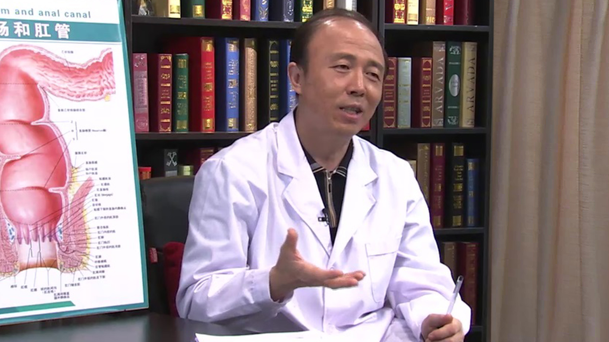

# 20.6 肛裂

---

## 王振彪 主任医师

首都医科大学附属北京世纪坛医院中医外科主任 中西医结合肛肠科主任 北京圣马克医院主任医师。

中华医学会中医药高等教育学会临床教育研究会肛肠分会常务委员兼副秘书长；中华医学会授予全国中医肛肠学科名专家；中华中医药学会肛肠专业委员会常务委员；中华中医药学会活血化瘀专业委员会常务委员；中华中医药学会亚健康专业委员会委员；中国中西医结合学会大肠肛门病专业委员会委员；北京医师协会肛肠专业专家委员会委员；北京中医肛肠专业委员会常务委员；北京中西医结合学会大肠肛门病专业委员会副主任委员。

**主要成就：** 在国内外核心期刊发表论文20余篇；主持完成多项国家省部级课题；多次主次参加全国肛肠学科继续教育培训班授课及教材编写工作。

**专业特长：** 擅长用中西两法诊治外科及肛肠科各种疑难杂症，如直肠粘膜脱垂（套叠）、重度环状混合痔、高位复杂肛瘘、直肠膨出、溃疡性结肠炎、便秘、肠癌等。对肛肠疾病的微创及无痛技术有很深的造诣，如PPH；STARR；LIFT-PLUG；套扎；挂线；注射固脱法；穴位埋线等，疗效显著。

---
