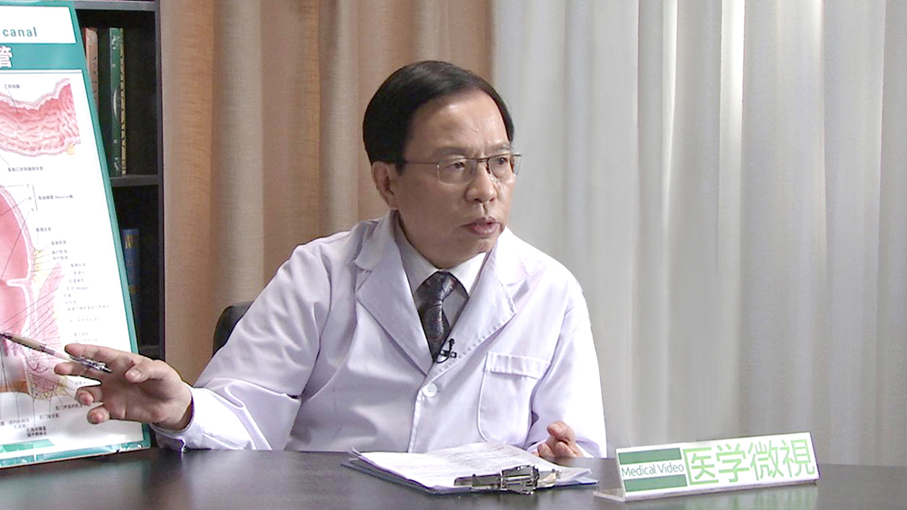

# 20.9 肛周脓肿

---

## 李国栋 主任医师

中国中医科学院广安门医院肛肠科主任 主任医师 博士生导师 全国重点肛肠学科带头人。

中国中医药学会肛肠专业委员会副主任委员；中国民族医药学会肛肠专业委员会会长；中国中医科学院学术委员会委员；高等教育联合会肛肠专业委员会副主任委员；世界中医联合会肛肠专业委员会副会长。

**专业特长：** 从事肛肠疾病的中西医结合治疗研究工作40余年，擅长采用中医、西医二法对肛肠科常见病和疑难病进行诊治，如各类痔、复杂性肛瘘、肛裂、直肠脱垂、结直肠癌、溃疡性结肠炎、顽固性便秘等。

---
