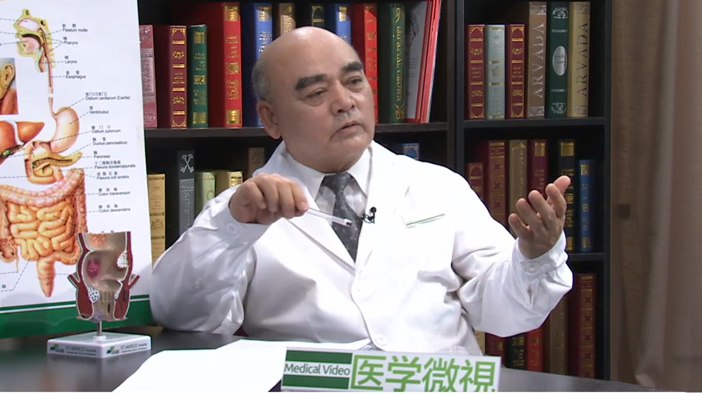

# 20.11 直肠脱垂

---

## 赵宝明 主任医师

北京中医药大学东直门医院肛肠科主任 博士生导师。

中华中医药学会首批“全国肛肠学科名专家”；中国中医药学会肛肠学会副会长；全国名医理事会副会长；北京中医药学会肛肠专业委员会主任委员；世界中医药学会联合会固脱疗法研究会会长。

**主要成就：** 1997年被广安门医院评为有突出科研贡献的科技先进个人；1998年获中国中医研究院科技进步二等奖；1999年获国家中医药管理局科技进步三等奖；2000年获国家发明专利1项（一种止痛泡沫气雾剂）；主编学术专著6部，国内外发表学术论文30余篇。

**专业特长：** 擅长中医及中西医结合治疗大外科相关疾病，在研究大肠肛门病等方面积累了数万例手术经验。祖传中医药世家,自幼庭训，酷爱医学，师承授受，先后师从史兆岐、张殿文、丁泽民、王沛著名医家。曾受到美国、日本、新加坡、马来西亚等国家邀请进行学者访问、学术交流及技术指导。具有非常丰富的临床、科研、教学经验，在国内外培养一大批专业人才。

---
