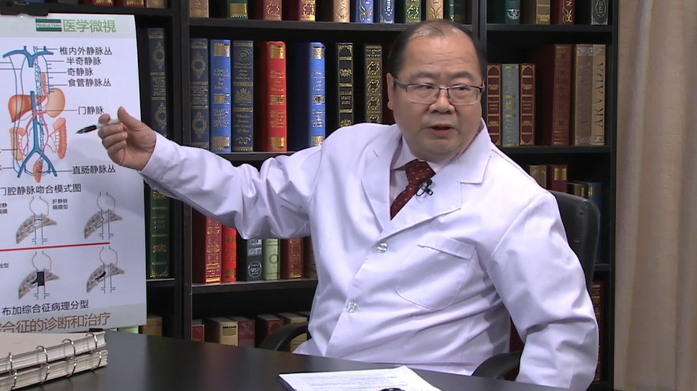

# 21.1 布加氏综合征

---

## 陈学明 主任医师

北京市血管外科中心主任；首都医科大学附属北京友谊医院血管外科主任 主任医师。

中华医学会北京分会血管外科学会副主任委员；中华医学会组织工程与血管外科学会常委；中国中西医结合学会周围血管疾病专业委员会常委；北京医师学会血管介入医师学分会副主委。

**主要成就：** 2004年入选国家百千万人才工程北京市级人选；获国家科技进步二等奖一项，部级成果奖五项；发表论文50余篇，参与编书四本。

**专业特长：** 擅长血管外科疾病的诊治，对血管外科的许多疑难病例具有丰富的诊疗经验，特别是对主动脉瘤、肢体缺血、大动脉炎、颅外阻塞性脑血管疾病、布加综合征及静脉血栓性疾病具有较深研究。

---
