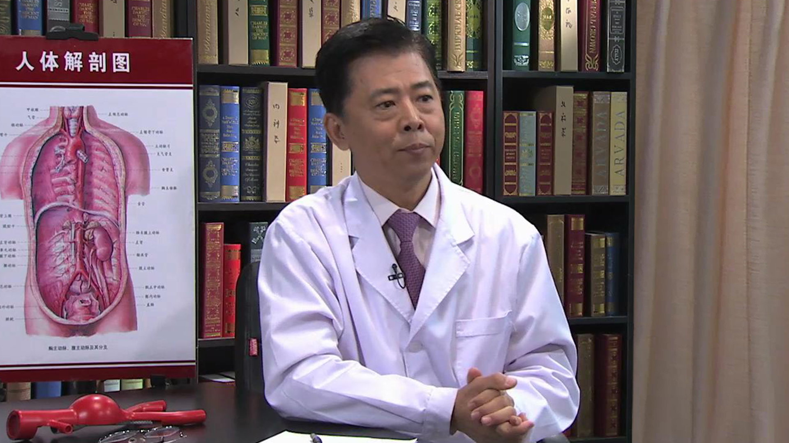

# 21.4 腹主动脉瘤

---

## 刘昌伟 主任医师

北京协和医院血管外科主任 主任医师 博士生导师 教授。

中华医学会外科学分会血管外科学组副组长；中国医师协会外科分会血管外科委员会副主任委员；中国医师协会腔内血管学专业委员会副主任委员；北京医师协会血管外科专科医师分会会长；北京医师协会血管与腔内血管外科专家委员会主任委员；北京医学会血管外科专业委员会副主任委员。

**主要成就：** 多次获得北京协和医院医疗成果奖和科研成果奖、中国医学科学院医疗成就奖等，并获得中国医学科学院北京协和医院临床重点项目支持；参加了多项国际多中心临床研究项目等；先后发表论文近100余篇。

**专业特长：** 擅长腹主动脉瘤的手术和腔内治疗；急性主动脉夹层的微创治疗；颈动脉狭窄的外科治疗；下肢动脉硬化闭塞症的手术和微创治疗；下肢静脉疾病和各种血栓栓塞性疾病的外科治疗等方面具有丰富的临床经验。

---
