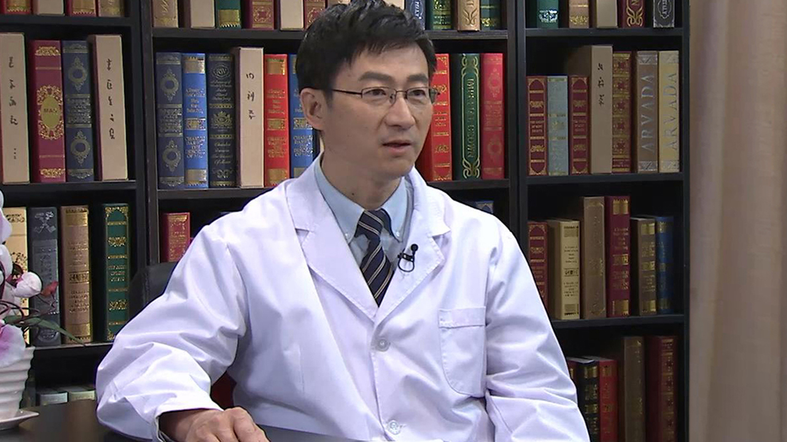

# 21.8 颈动脉内膜剥脱

---

## 李拥军 主任医师

北京医院血管外科主任 主任医师 博士研究生导师 教授。

；中华医学会血栓性疾病防治委员会学术秘书；中国医师学会外科医师分会血管外科医师委员会委员；中国微循环学会周围血管疾病专业委员会常务委员；中国医疗保健国际交流促进会血管外科专业委员会常务委员兼颈动脉外科学组副组长；国家心血管病专家委员会血管外科分会副秘书长。

**主要成就：** 2011年获得华夏医学科技奖三等奖（第1获奖人）；2013年获得中华医学会血栓防治委员会突出贡献奖；承担国家自然科学基金3项，人事部归国人员基金1项、首都医学发展科研基金1项、杨森科学研究基金1项；主编《颈部血管外科学》，参编《血管外科临床手册》《外周血管外科腔内装备大全》等多部著作；以第一作者或通讯作者身份发表论文50余篇，其中SCI 9篇。

**专业特长**  **：** 主要从事外周血管疾病的诊断和治疗工作，擅长动脉硬化性闭塞症，大动脉炎，糖尿病性血管性病变，主动脉瘤，外周动脉瘤，主动脉夹层，静脉血栓等疾病的外科和药物治疗。

---
