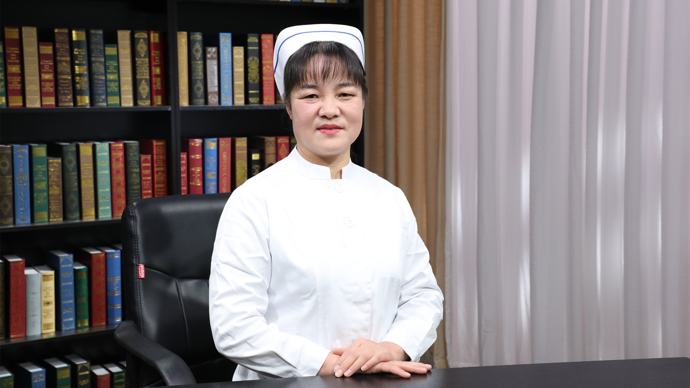

# 21.10 静脉血栓栓塞症的护理

---

## 赵秋月 主任护师

首都医科大学附属北京胸科医院胸外二科护士长。

中国医师人文医学执业技能培训体系中国境内签约讲师 ；首都医科大学讲师；北京卫生职业学院临床授课教师。

**主要成就：** 多次参与国家级、省市级继续教育讲课；在核心期刊发表护理论文25篇，其中第一作者13篇，包括SCI 1篇，参与《外科护理学高级教程》《实用结核病护理学》《现代结核病护理学》书籍编写工作。

**专业特长：** 从事普胸外科临床护理工作30余年，熟练掌握胸外科护理理论与技能。对气管成型、血管成型或置换、全隆凸切除重建、复杂肺切除、胸内巨大肿瘤切除、多脏器联合切除等疑难重症患者的护理具有丰富经验；擅长术前低肺功能、大咯血，术后并发呼吸衰竭、支气管胸膜瘘等患者的护理，在PICC疑难置管及维护方面具有丰富经验。

---
