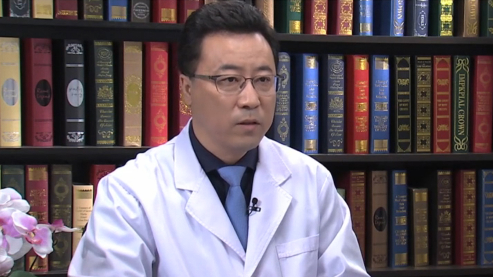

# 21.16 下肢动脉硬化闭塞症

---

## 沈晨阳 主任医师

首都医科大学附属北京天坛医院血管外科中心副主任 周围血管病房主任 主任医师 博士研究生导师。

欧洲血管外科学会（European Society for Vascular Surgery, ESVS）会员；美国血管外科学会（Society for Vascular Surgery, SVS）会员；中国医学装备协会管理委员会主任委员；中华医学会医学工程分会常委；中国医师协会腔内血管外科分会静脉学组秘书；北京医师协会血管外科专科医师分会 常务理事。

**主要成就：** 在国内外核心学术期刊已发表第一作者学术论文包括SCI论文数十篇；参与《克氏外科学》《外科学应试指南》《实用胸部外科学》《血管病学》《血管外科疾病彩色图谱》等书籍的编写和编译工作。

**专业特长：** 在国内较早开展了主动脉夹层动脉瘤、胸腹主动脉瘤、内脏动脉瘤、颈动脉、肾动脉狭窄、复杂下肢动脉硬化闭塞症的腔内及开放手术。对血管外科疑难疾病“布加氏综合征”开展了腔内及开放手术的根治性治疗、切除肿瘤侵犯右心房及下腔静脉十余例，擅长复杂周围动脉及静脉系统疾病的治疗，治疗技术和水平上均处于国内领先地位。

---
