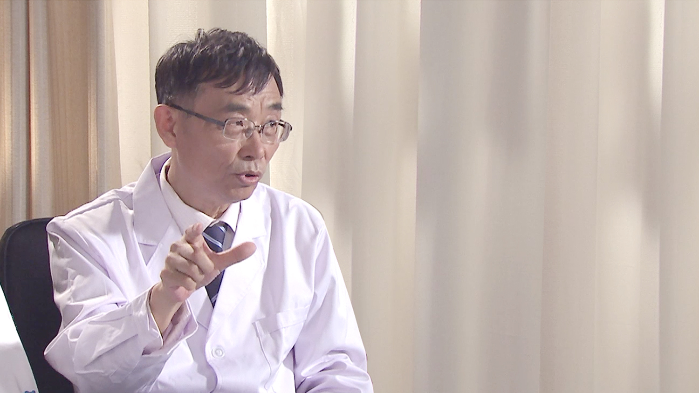

# 21.17 下肢静脉曲张

---

## 杨博华 主任医师

北京中医药大学东直门医院血管外科任科主任 主任医师 教授 博士生导师。

北京中医药大学中医外科教研室主任；北京市周围血管病中医特色诊疗中心主任；中国中西医结合学会血管专业委员会候任主任委员；北京中西医结合学会血管病专业委员会主任委员；中华中医药学会疮疡专业委员会副主任委员；中国中医药高等教育学会临床教育中医外科分会秘书长。

**主要成就：** 在国家一类杂志发表学术论文70余篇，著作8部。《益气活血方促进自体骨髓干细胞移植治疗下肢PAOD的临床和实验研究》获中国中西医结合学会科学技术三等奖。 主要成就： 作为第一负责人承担了国家自然科学基金课题、国家“十五”、“十一五”攻关课题、国家中医药管理局课题、北京市首都医学发展基金课题、教育部博士点基金课题等十余项课题。

**专业特长：** 擅长血管外科、普通外科的中西医结合治疗，专注于难治性溃疡的临床与实验的研究。

---
