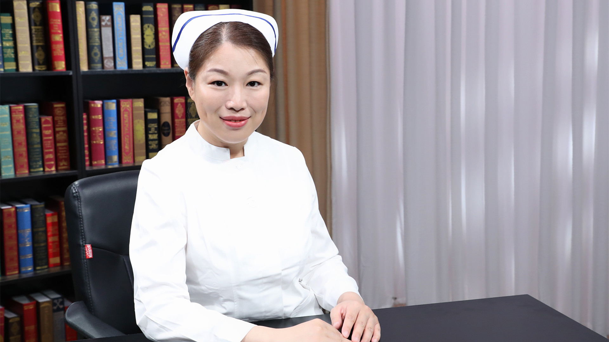

# 21.18 下肢静脉性溃疡的护理

---

## 张欣 主管护师

首都医科大学附属北京同仁医院外科门诊护士长 国际造口治疗师。

中华护理学会灾害护理专业委员会专家库成员；北京护理学会伤口 造口 失禁专业委员会委员；中国医促会糖尿病足分会足部护理学组委员；北京医学会创面修复分会护理学组委员；中国康复医学会修复重建外科专业委员会创面治疗学组委员。

**主要成就：** 北京医管局颁发“张欣创面治疗护理工作室”；北京总工会颁发“最美劳动者称号”；北京护理学会颁发“杰出护理工作者”；院级颁发“优秀护士”、“十佳护士”、“优秀教师”；院级颁发“优秀护士长”、“先进个人”、“最佳人气奖” ；科研课题4项；主编专业书籍2本；发表论文10余篇。

**专业特长：** 擅长各类无菌伤口以及压疮、下肢静脉溃疡、糖尿病足等慢性伤口的护理。

---
