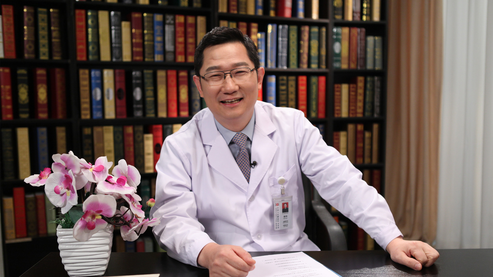

# 21.24 主动脉夹层//郭伟教授

---

## 郭伟 主任医师

中国人民解放军总医院(301医院)全军血管外科中心主任  主任医师 博士生(后）导师。

中国研究型医院学会血管医学专业委员会主任委员 ；中国医师协会血管外科医师委员会副主任委员 ；中国医疗器械行业协会血管器械分会主任委员；美国血管外科学会（SVS）会员 。

**主要成就：** 发表论文280余篇，SCI收录50余篇，单篇最高影响因子19.8分；以第一责任人承担课题国家自然基金1项，首发基金2项、全军十一五保健基金2项，科技部基金1项，科技成果转化基金2项；获国家科技进步一等奖1项,全军医疗成果一等奖1项，全军医疗成果二等奖1项，北京市科学技术一等奖1项，北京医学科技奖一等奖1项。

**专业特长：** 擅长腔内及腔外血管外科技术的临床应用研究，引领并推动了我国主动脉瘤及夹层、动脉狭窄与闭塞性疾病微创腔内治疗技术的发展与普及，并建立了一整套主动脉腔内修复技术方式与方法。

---
