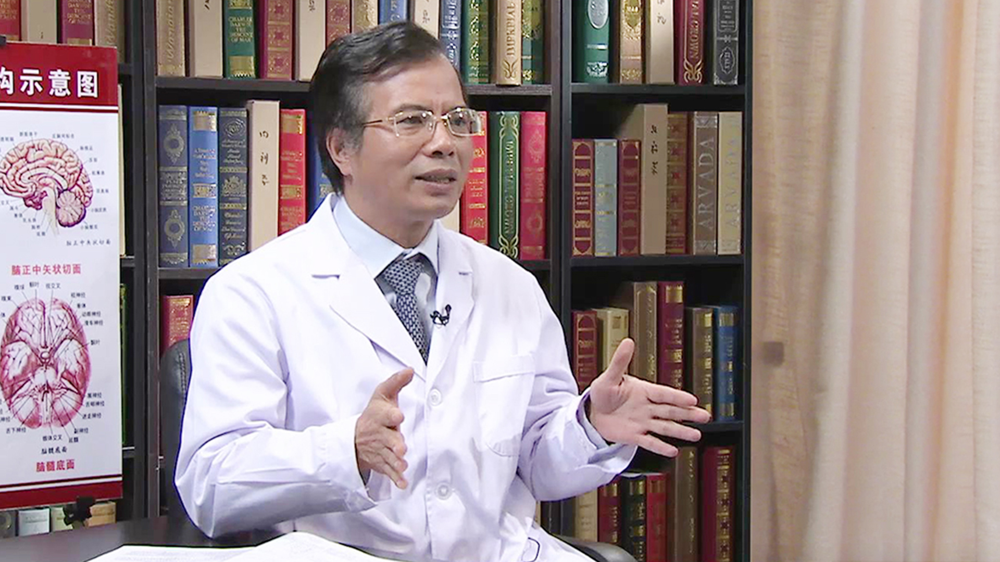

# 21.27 主动脉瘤//张小明教授

---

## 张小明 主任医师

北京大学人民医院血管外科主任 主任医师 博士生导师。

中国外科医师分会血管外科医师委员会候任主任委员；中国医疗保健国家交流促进会血管外科专业委员会副主任委员；中国微循环学会血管外科专业委员会副主任委员；国家心血管病中心血管外科专业委员会副主任委员；中国医师协会介入医师分会常委兼大血管专业委员会副主任委员；中国老年医学会血管外科分会副主任委员；北京医师协会血管外科分会副主任委员；北京医学会血管外科分会副主任委员；中国医疗器械协会血管医学转化分会副主任委员；海峡两岸医学交流协会血管外科专业委员会常委；中国医师协会腔内血管学专业委员会常委兼主动脉瘤副主任委员；血管与腔内血管外科杂志副主编；中华生物医学工程学会血管及工程分会委员；亚洲血管外科学会会员；国际布加氏综合征学会会员；中华普通外科杂志编委；中华外科杂志特约编委；中华生物医学工程杂志编委；中国民康医学杂志编委；中国血管外科杂志(电子版)编委；实用医院临床杂志编委；当代介入医学电子杂志编委；中华老年多器官疾病杂志编委；介入放射学杂志编委；协和医学杂志编委；《手术》杂志编委；北京大学心血管外科系副主任；中国布加综合症研究会副主席；北京军区总医院血管外科名誉主任。

**专业特长：** 从事血管外科方面的医、教、研工作十余年。擅长血管外科的各类高难度传统手术及血管腔内介入治疗，包括：主动脉瘤及主动脉夹层的传统外科手术和介入治疗；布-加氏综合征的根治手术和介入治疗；颈动脉、锁骨下动脉、髂股动脉狭窄及动脉瘤的手术和介入治疗；肿瘤侵犯大血管的手术治疗；下肢动脉硬化闭塞症和糖尿病足的综合治疗；肺栓塞的外科治疗；肾血管性高血压的外科治疗。

---
