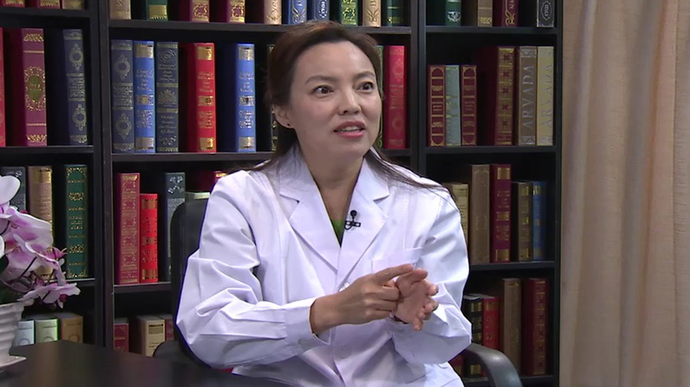

# 23.3 川崎病

---

## 石琳 主任医师

首都儿科研究所附属儿童医院心血管内科主任 主任医师。

中华医学会儿科学分会心血管学组委员；中华医学会北京分会儿科学分会心血管学组副组长；中国医师协会儿科医师分会心血管学组委员；中西医结合学会儿科学分会心血管学组组长；北京高血压防治协会理事；全国小儿心律学工作委员会委员；中国小儿急救医学杂志通讯编委

**主要成就：** 在国内外核心期刊杂志发表论文 30 余篇，其中 SCI 论文 5 篇，参与编著学术著作数部。

**专业特长：** 从事儿科心血管临床工作二十余年，能熟练、独立处理儿科及心血管专科的常见病和疑难病，擅长于扩张型心肌病、高血压，直立不耐受、川崎；省部级课题五项，对肺动脉高压和先天性心脏病的发病机制、血管迷走性晕厥.高血压等有较深入的研究。

---
