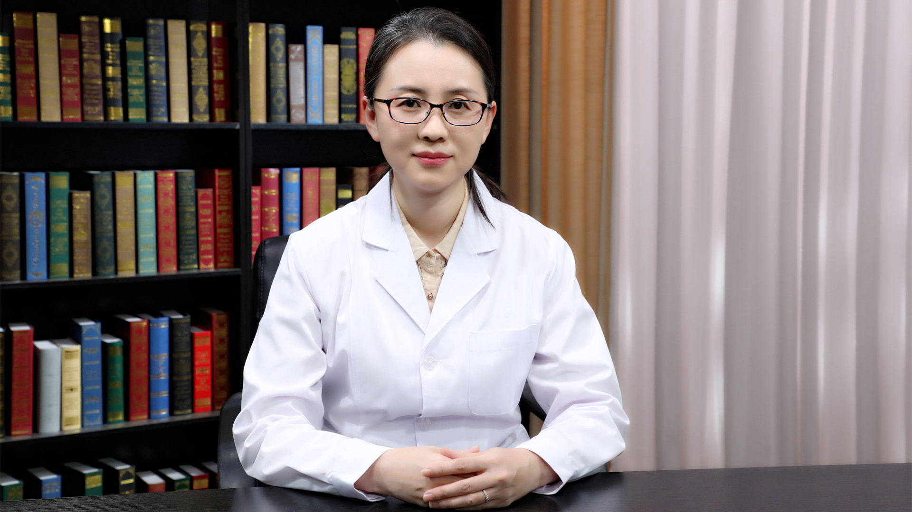

# 23.4 大动脉炎

---

## 潘丽丽 主任医师

首都医科大学附属北京安贞医院风湿免疫科副主任 主任医师 医学博士 副教授 硕士生导师。

北京医学会风湿病学分会青年委员；北京医学教育协会风湿病学专科分会委员；中国风湿免疫病相关生殖与妊娠研究委员会委员；海峡两岸医药卫生交流协会风湿免疫病学专业委员会银屑病关节炎学组委员。

**主要成就** ：以第一作者及通讯作者发表学术论文30余篇，其中SCI 收录13篇；主持国家自然科学基金项目2项，承担首都医科大学医疗系及预防系本科生《内科学》《临床免疫学》《诊断学》的教学工作。

**专业特长** ：从事内科临床工作20余年，具有丰富的临床工作经验。近年来主要从事自身免疫病心血管损害的研究，擅长大动脉炎、白塞病、巨细胞动脉炎、自身免疫病心血管损害的诊治。

---
