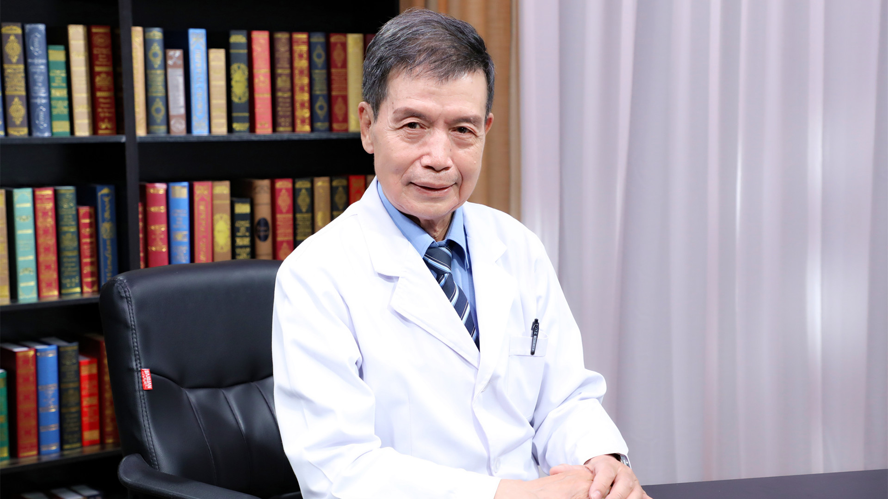

# 23.6 风湿免疫科症状-腮腺、眼眶肿

---

## 伍沪生 主任医师

北京积水潭医院风湿免疫科主任医师；北京大学医学部风湿免疫学系副主任 教授.

北京医学会风湿病学分会顾问；海峡两岸医药卫生交流协会风湿免疫病学专业委员会顾问；中国老教授协会医药专业委员会理事及骨关节病副主任委员；北京医师协会风湿免疫科医师分会常务委员。

**主要成就：** 1996年创立了北京积水潭医院风湿免疫科，长期从事医教研工作，具有丰富的临床工作经验和教学科研能力，深受广大患者及同行好评；先后主编、副主编、参编20余部专著，公开发表60余篇专业文章；《北京医学》杂志常务编委，《中国医药科学》《风湿病与关节炎》杂志编委，《医学参考报•风湿免疫频道》《中华风湿病学杂志》编委。

**专业特长：** 擅长类风湿关节炎、系统性红斑狼疮、干燥综合征、系统性血管炎、脊柱关节炎、骨关节炎、痛风等风湿性疾病的诊治，尤其对高尿酸血症及痛风有较深入的研究。

---
