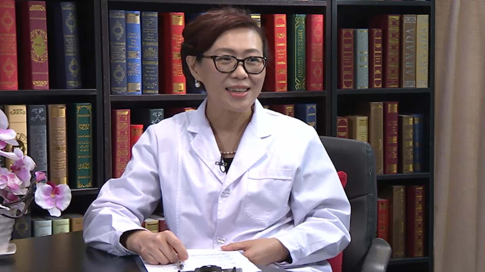

# 23.15 干燥综合征

---

## 张卓莉 主任医师

北京大学第一医院风湿免疫科主任 主任医师 教授 博士 博士研究生导师。

中华医学会风湿病分会常务委员兼副秘书长；中国医师学会风湿病分会常务委员；北京风湿病分会副主任委员；心血管病分会肺血管病学组委员；卫生部国家医学考试中心风湿组组长。

**主要成就：** 2007年组建l北京大学第一医院风湿免疫科，10年期间科室得到快速发展，得到同行和患者的认可和赞扬。国内引领了新型影像学技术在风湿病学中的应用。在主持多项国家、北京市及部委科研项目，。获得国际及国内近20个奖项，发表文章200余篇。

**专业特长：** 近30年来始终工作在临床第一线，同时从事教学和科研工作，曾经在英国和荷兰从事风湿病临床和科研工作4年；擅长各种关节炎、红斑狼疮、干燥综合征、血管炎等各种风湿免疫性疾病的诊断和治疗。

---
