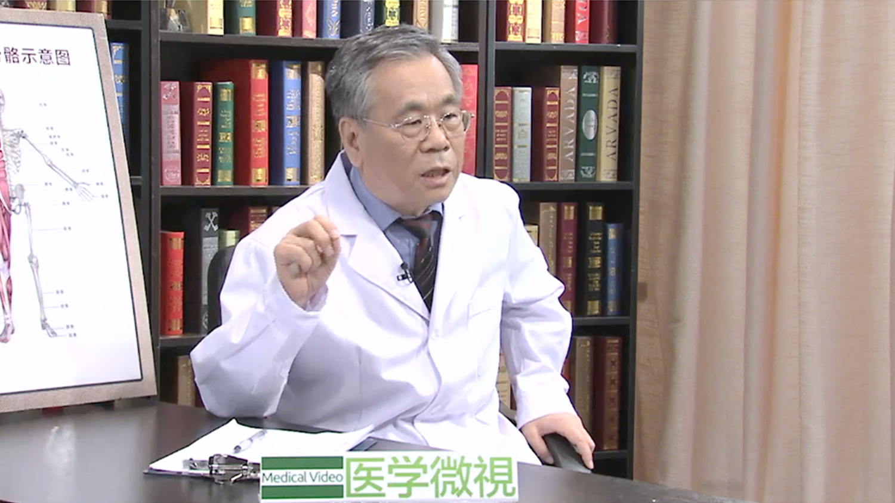

# 23.20 皮肌炎

---

## 吴东海 主任医师

中日友好医院风湿免疫科主任医师 首席专家。

中华医学会风湿病学分会第五届、第六届委员会副主任委员；中国医师协会风湿免疫科医师分会委员会顾问；中国康复医学会骨与关节及风湿病专业委员会资深专家、副主任委员；中华医学科技奖和中华医学青年奖评审委员会委员。

**主要成就：** 发表论文98篇，在国内外杂志发表文章90多篇；主编《实用临床风湿病学》《临床风湿病学》；主译《Oxford Textbook of Rheumatology 》。

**专业特长：** 从医40年，擅长红斑狼疮、类风湿关节炎、皮肌炎、硬皮病等风湿免疫性疾病的诊断和治疗。

---
