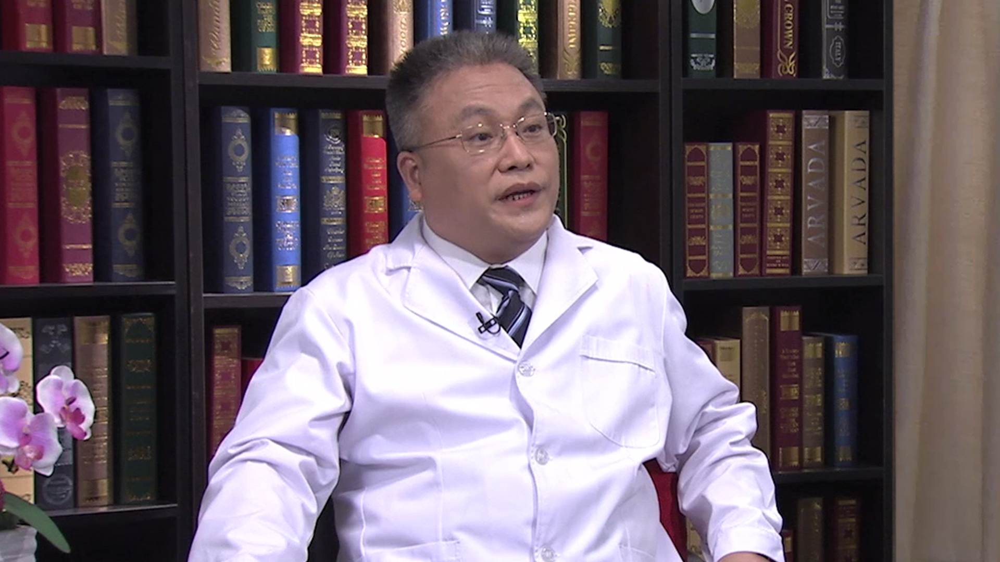

# 23.24 系统性血管炎

---

## 曾小峰 主任医师

中国医学科学院北京协和医院风湿免疫科主任 主任医师 博士生及博士后导师。

中华医学会风湿病学分会主任委员；中国医师协会风湿免疫科医师分会会长；中国系统性红斑狼疮研究协作组（CSTAR）及国家风湿病数据中心（CRDC）创始人和负责人；国家13.5项目首席科学家 国家863计划专家；北京医学会风湿病专业委员会名誉主任委员。

**主要成就：** 2014年获首届中央人民广播电台“京城好医生”之“优秀好医生”称号，荣获医师报2016年度推动行业前行的力量十大医学贡献专家称号，2016年度全国优秀科技工作者荣誉称号获得者；先后主持国家11·5科技支撑计划、12·5- 863计划系统性红斑狼疮相关课题及13·5国家重点研发计划项目首席科学家；2009年创建CSTAR，随后在卫计委的领导下建立了CRDC；发表SCI文章100余篇，SCI总分超过300分，其中通信作者39篇，SCI总分121.767分；《内科学》教材副主编，《中华内科》杂志等4份杂志副主编，主译《哈里森风湿病学》。

**专业特长：** 长期从事风湿病的临床及发病机制的研究，尤其是在类风湿关节炎的早期诊断、血管炎的诊治及发病机制、干燥综合征等方面进行了系统性的研究，填补了多项国内空白。擅长系统性红斑狼疮、类风湿关节炎、干燥综合征、血管炎及各种疑难风湿性疾病的诊治。

---
