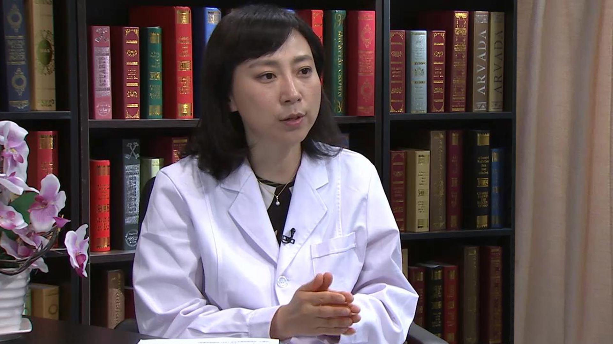

# 23.25 系统性硬皮病

---

## 穆荣 主任医师

北京大学第三医院风湿免疫科主任 主任医师 博士生导师。

中华医学会风湿病学分会中青年委员会副主任委员；北京免疫学会理事；亚太风湿病联盟教育委员会共同主席；海峡两岸医药卫生交流协会风湿病专家委员会常委兼副总干事；《中华风湿病学杂志》编委；《健康世界》编委。

**主要成就：** 先后承担包括国家自然科学基金、十二五重大新药创制、973子课题等多项科研基金；中华医学科技进步二等奖及三等奖；高等学校科学研究优秀成果奖二等奖；北京市科技进步奖二等奖；华夏医学科技奖一等奖；中华风湿病学优秀论文一等奖；欧洲抗风湿病联盟优秀论文奖；亚太地区抗风湿联盟travel grant；东亚风湿病联盟青年研究者奖；发表文章50余篇，参与编写了10余部风湿病和免疫学方面的专著。

**专业特长：** 在多年的临床实践中对各种风湿免疫病的诊断及治疗积累了丰富的经验，擅长类风湿关节炎、系统性红斑狼疮、强直性脊柱炎、干燥综合征、血管炎和痛风等多种风湿病及疑难病例的诊断和治疗。

---
