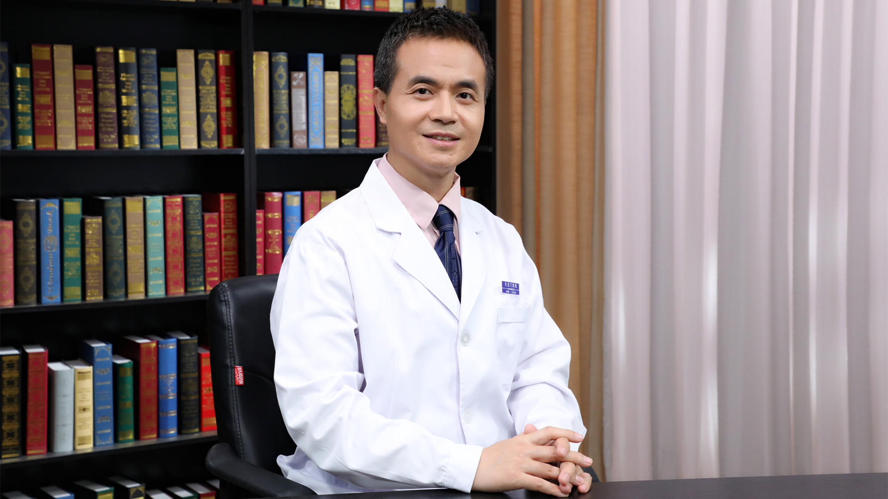

# 23.27 中医治疗痛风

---

## 王海隆 主任医师

北京中医药大学东直门医院风湿病科主任 主任医师 研究生导师 博士后合作导师。

贵州中医药大学特聘教授 贵阳市发展和改革委员会特聘顾问；中华中医药学会风湿病分会常务委员 第二届青年委员会副主任委员；中华中医药学会针刀医学分会委员；北京中医药学会风湿病专业委员会秘书；中国中医药研究促进会青年医师分会副主任委员；中国中医药研究促进会心身医学专业委员会副秘书长；白求恩医学专家委员会青年科学家委员会副主任委员；世界中医药学会联合会风湿病专业委员会常务理事；京津冀风湿病共同体秘书。

**主要成就：** 全国中医临床特色技术传承骨干人才，国家自然科学基金通讯评审专家，*Traditional Medicine Research *青年编委，*BMJ Open  Frontiers in Pharmacology  Chinese Journal of Integrative Medicine* 审稿人；主持、参与多项国家级、省部级课题，主编专著两部（一部英文，一部西班牙文），在国内外发表论文多篇；获得中华中医药学会科学技术奖一等奖一项、三等奖一项，中国中医科学院科学技术奖二等奖一项；获第一届“国家卫生计生委优秀青年”称号；中国中医科学院及广安门医院青年岗位能手、中青年科技标兵。

**专业特长：** 擅长类风湿关节炎、高尿酸血症/痛风、脊柱相关疾病、颈肩腰腿痛、干燥综合征、系统性红斑狼疮、产后风湿病、肌炎/皮肌炎、硬皮病、系统性血管炎、抗磷脂综合征、IgG4相关疾病、风湿性多肌痛、复发性多软骨炎、纤维肌痛、免疫力低下、自身炎症性疾病的诊疗以及风湿病合并妊娠的管理和治疗、肿瘤术后和放化疗后康复及复发转移预防；尤其擅长使用针刀及关节镜技术治疗风湿病所致关节疼痛和功能障碍及慢性软组织损伤。

---
